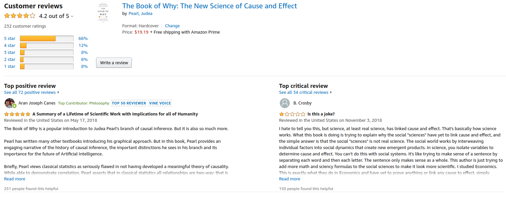
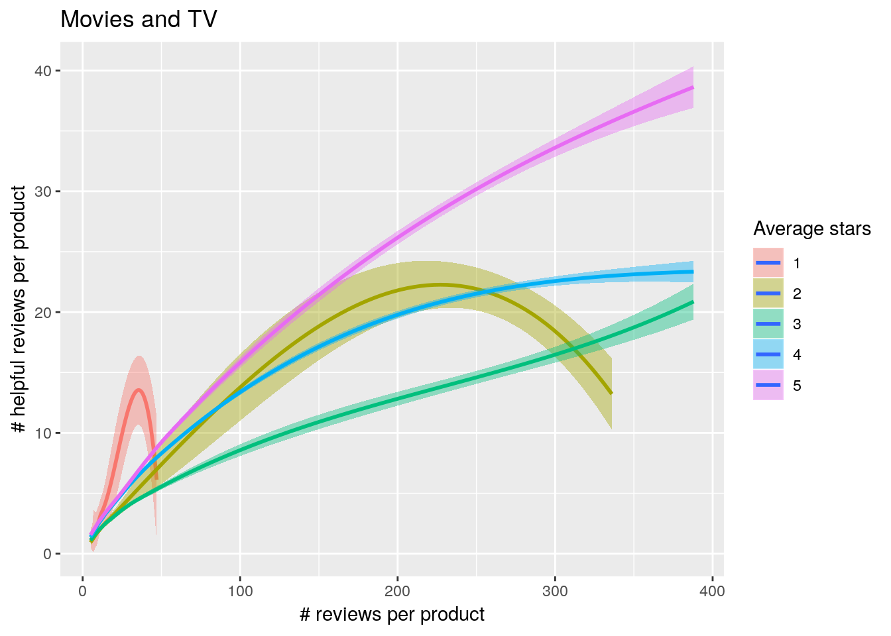
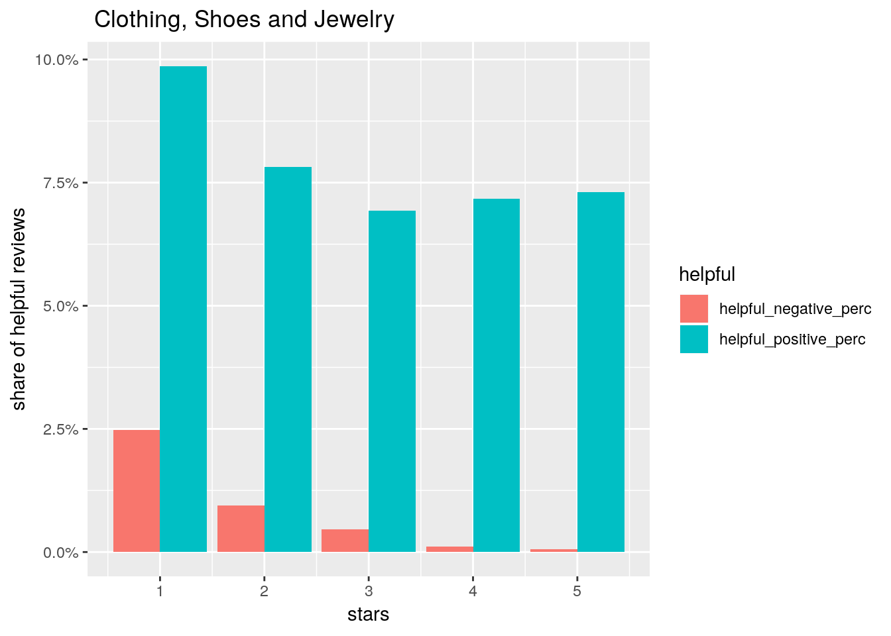
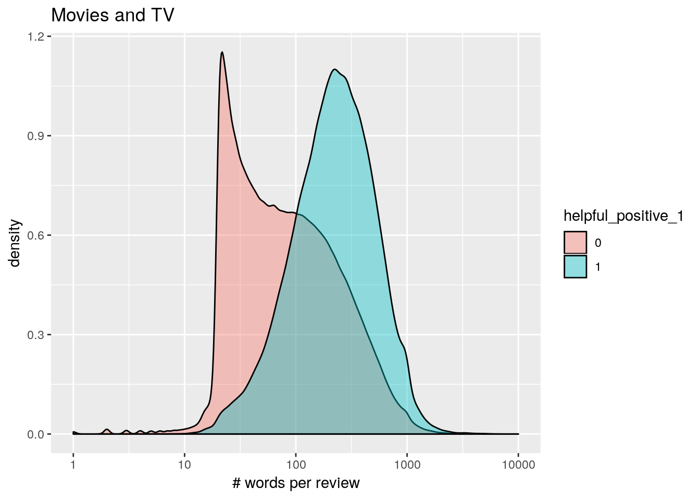
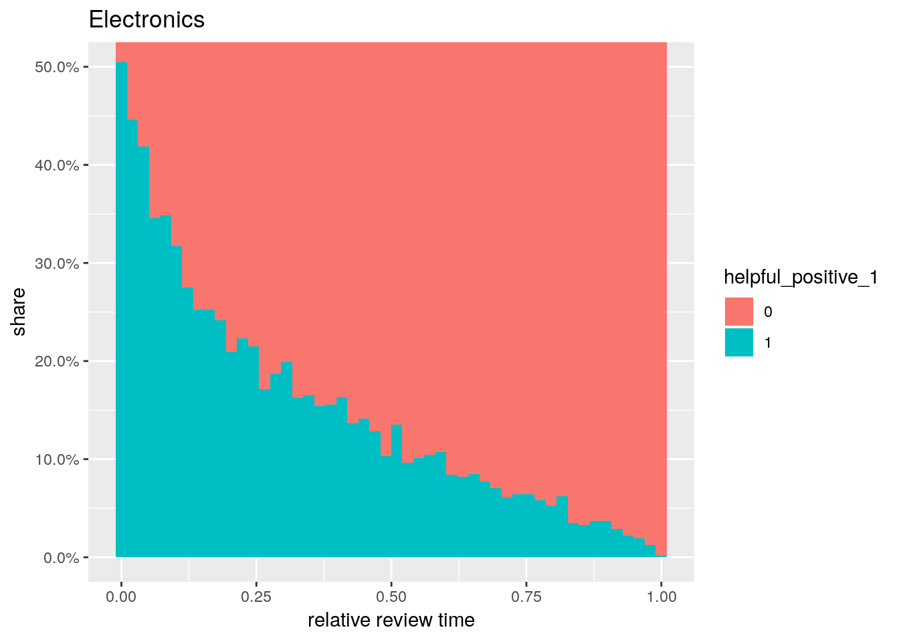
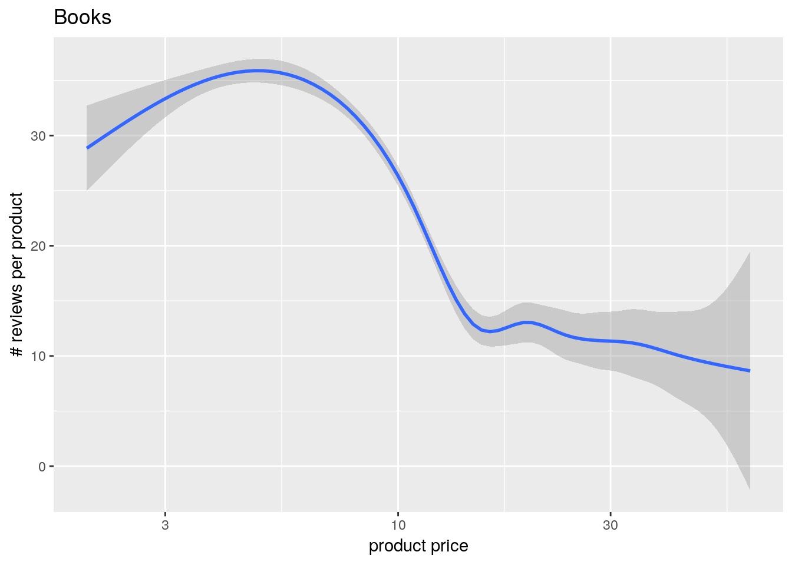
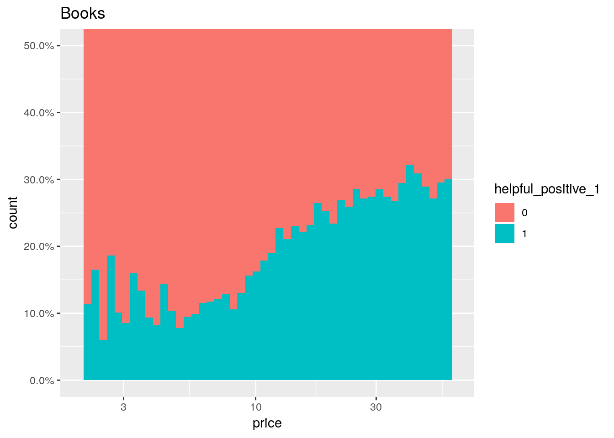
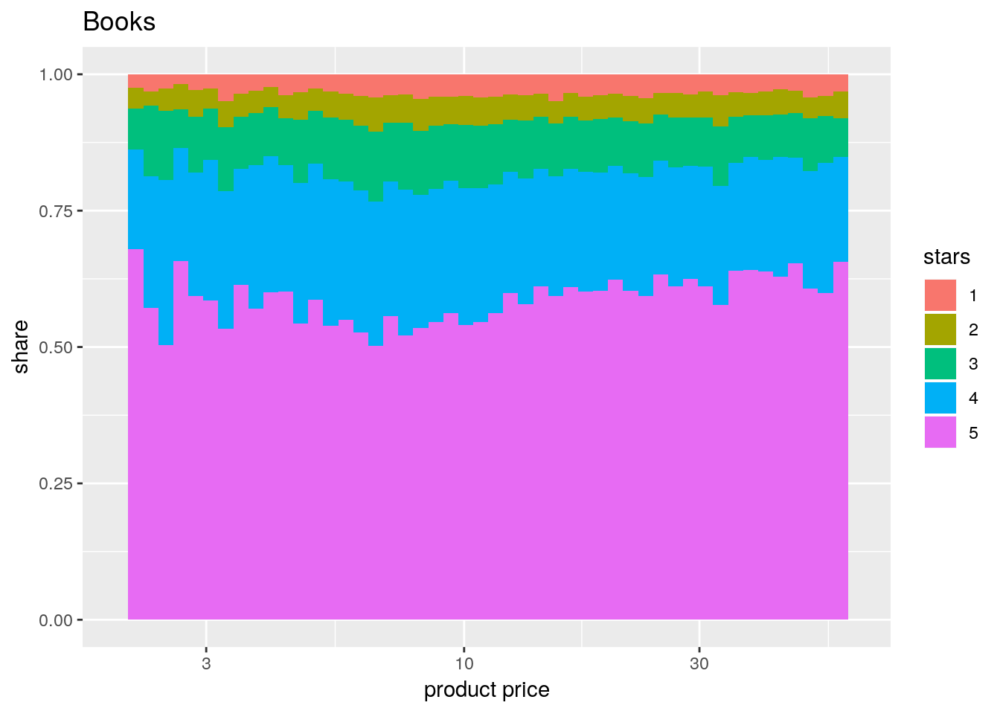
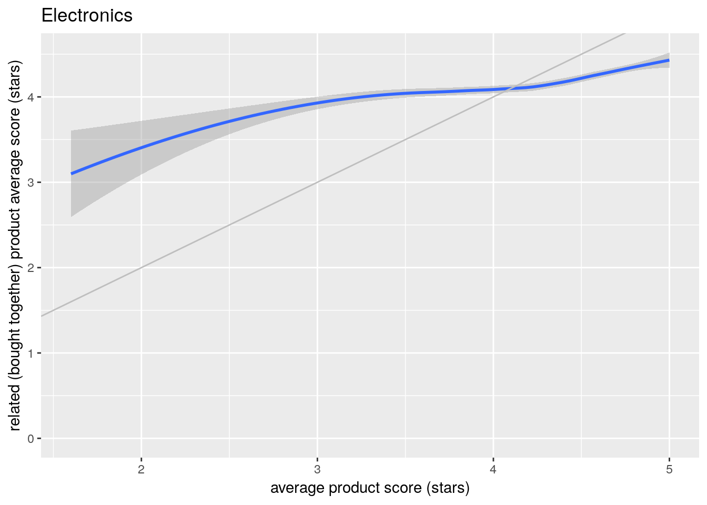
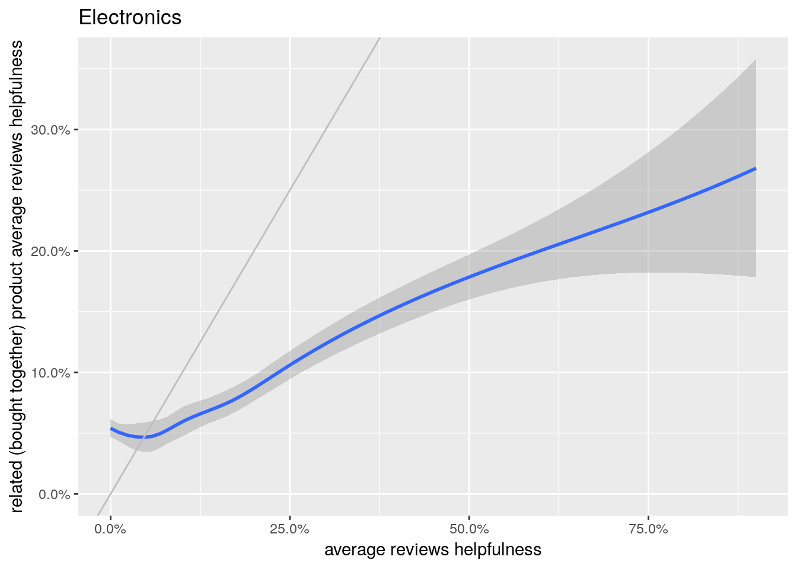

---
output:
  html_document: default
title: "Amazon reviews analyses for takeaway.com"
---

# Case definition 

Please present your analysis and actionable insights, as if you were to present to the management of Amazon. The "Actionable business insights" should be based on data, an example of an analytical approach is as follows:

1)What is the relation between the reviews and the helpfulness?

2)What is the review behavior among different categories?

3)Is there a relationship between price and reviews?

4)Which group of reviewers is more valuable to the business?

5)Is there a relation between reviews from products which are bought together?

6)Optional - Any other hypothesis you think is interesting, as long it would have business value for Amazon

## Data

The data is available at:
https://drive.google.com/drive/folders/0B2Cb2o7SwJVgR08tV1UwUXRXMUE?usp=sharing

The description of the data: http://jmcauley.ucsd.edu/data/amazon/links.html

In case you cannot process all data then please use below two files in the above folder, or you can take another approach to efficiently conduct your analysis.
reviews_Clothing_Shoes_and_Jewelry_5.csv
metadata_category_clothing_shoes_and_jewelry_only.csv

## Tool

You can use whatever tools/languages in order to solve the questions. Please make the product in such a way so that you are sure it could run in a production's setting.

## Timeline
Please send in your code and presentation via email at the latest by next week Friday, January 24, 10.00 am (CET). 

# Solution

## Tools

R/Rmarkdown was used for the analyses/data visualizations.
The outputs are 4 html reports (one for each category).

Part of the analyses was done on local computer, the heavy lifting provided AWS (Ubuntu + Rstudio server).

## Data and definitions

Four categories of products offered on Amazon were analyzed:

* Clothing, Shoes and Jewelry
* Movies and TV
* Electronics
* Books

Data included set of products and reviews. It is not full set of the Amazon products.

After parsing the data, I took these attributes connected to reviews:

* asin - product key
* stars - integer 1 - 5, the review rating. 5 is best.
* helpful_positive - number of (positive) up-votes of the review - number of user who found this review helpful
* helpful_negative - number of (negative) down-votes of the review - number of users who hit "Report abuse" (not sure)
* helpful_positive_1 - 0/1 -  the review is helpful positive if it has at least 3 up-votes and there is at least 80% positive votes (1), 0 otherwise
* helpful_negative_1 - 0/1 -  the review is "helpful" negative (spam) if it has at least 3 down-votes and there is at least 80% negative votes (1), 0 otherwise
* tokens - a vector of unique base words excluding stop words (trying to extract only words baring some meaning)
* n_words - number of words in the review
* relative_review_time - number [0,1], $\frac{\text{Review order} - 1/2}{\# \text{reviews of given products}}$ (used for distinguishing older and newer reviews)

These attributes are connected to products:

* asin - product key
* price - product price (although price might be changing with time + there might be different sellers of the same product, so this must be only illustrative)
* also_bought - vector of asin of products that are often in the same basket with this product

### Disclaimer

There are much more possibly useful attributes like: user, time of the day, day of the week, subcategory, brand, pictures etc.
The helpfulness can be certainly defined differently. 

Data quality was not investigated in depth. Products missing some key attributes were excluded. For deeper analyses the missing values should be investigated as a bias might be found in them.

## The outputs

* [Books report](http://htmlpreview.github.io/?https://github.com/zdenekvesely/takeaway_interview/dev/books_big.html)
* [Movies and TV report](http://htmlpreview.github.io/?https://github.com/zdenekvesely/takeaway_interview/dev/movies_all.html)
* [Electronics report](http://htmlpreview.github.io/?https://github.com/zdenekvesely/takeaway_interview/dev/electronics_all.html)
* [Clothing, Shoes and Jewelry report](http://htmlpreview.github.io/?https://github.com/zdenekvesely/takeaway_interview/dev/clothing_all.html)

We will use excerpts from these reports to answer the questions.

# Questions

## What is the relation between the reviews and the helpfulness?

There are more attributes that were evaluated against the helpfulness:

### The stars

Users can filter the reviews by the rating (stars). 
This can suggest there might be limited number of frequently shown reviews per rating.
But this and the corresponding plots for other categories show that there is not only constant number of helpful reviews per product.

These plots show that the positive reviews tend to be more helpful for movies and TV category, while for Clothing, Shoes and Jewelry it is the other way round. Books and Electronics seem not to have any strong pattern.

The spam-like reviews are more often for low rating reviews (1 star) for each category.

### Words (tokens)

I analyzed which words are linked to positive or negatives reviews and similarly with helpful or not helpful reviews. See the results in the reports.

Next step could be to identify words included in helpful high rating reviews as they may differ to helpful low rating reviews (critics).

Some of the positive adjectives are in all categories although still users describes best movies or books as *timeless*, *unforgettable* or *flawless*, but clothes are according to them *gorgeous*, *fantastic* and you will get some *compliments* wearing it.

The helpful words differ more between categories as they usually describe attributes of the goods.
Not really helpful clothes reviews mentions often relatives (e.g. "I bought it for my *sister* for her *birthday*" is not really helpful review). Similarly listing the actors in the movie review seems not to help.

### Review length

The longer the review the more helpful. This seems to be so for all four categories.

Se e.g. movies:

The big spike of relatively short not helpful reviews seems to be 5-star reviews where the user cannot be really bothered to write something non-trivial.

#### Review time order

Here it is as expected, the older reviews (of the given product) are more helpful.
There might be two straightforward explanations:

* The older review had more time to collect the up-votes.
* There is accumulation - the review with the most up-votes is shown at the top of the list. So it collects more up-votes. And the older review small advantage accumulates.

So for all four categories we can see similar plot:

## What is the review behavior among different categories?

Some differences I've already mentioned above (different distribution of helpfulness among the rating, different helpful words, etc.).
Let me mention few more examples:

There is higher "spam" reviews ratio in the movies category (and also in the books category).
These goods can be controversial, users can have very different opinions. On the other side the clothes or electronics have usually universally good or bad quality, the room for personal opinion is therefor limited.

The review text tends to be much shorter for the clothes, shoes and jewelry category comparing to other three.

First users tend to rate the books higher than the later ones. This might be fans effect - the fan will buy the book as soon as it is released. And as he/she is fan, the high rating can be expected.
The movies have similar property at IMDB.com but not at Amazon as this is not the channel where the movie fan could find the new released movies.

The number of reviews per product differs significantly between categories (although this statistic is not representative as in each category only products with 5 or more reviews are used). On one side of the spectrum are movies, on the other clothes.

## Is there a relationship between price and reviews?

I would be very careful to draw any conclusions here. The price different users were billed can differ and is not included in the data.

In general we can see that the more expensive products tend to have less reviews and (therefore) higher share of helpful reviews.

The rating itself seems not to be overly sensitive to the price. For some categories we can see decline in 1-starts review with the price but the pattern is not very strong.

It would be more interesting to analyze price impact on the reviews using price the user payed. There we might see better how are the reviews for the same product sensitive to price changes.

## Which group of reviewers is more valuable to the business?

I can only speculate here. 
I can analyze correlations (or other relations) based on these data.
I can find users or review attributes linked to bestsellers. But is the user attracted to bestsellers or is it he/she who makes positive the impact on the sales?
The causal relationship cannot be estimated without A/B testing.

I can assume that helpful positive review makes for good advertisement, especially if it posted early (and for more expensive products). We can try to find users with such reviews.

At the same time, the helpful low rating review can warn customers and slow down the sales, again especially at the early stages.

## Is there a relation between reviews from products which are bought together?

There is nice positive correlation between the rating and also the helpfulness share between products bought together, that is for all four categories.

## Optional - Any other hypothesis you think is interesting, as long it would have business value for Amazon

Using the words analyses and review length I can build model predicting the helpfulness of the new review. Using e.g. naive Bayes methods of NN. This can be used for ranking the new products reviews on the webpage, so that the users can be shown the potentially helpful review on top even before somebody up-voted it.

This can show value for the high-rate reviews (as they are basically advertising the product). The question is what to do with potentially helpful negative reviews? 
These can discourage user from buying the product. So to create the immediate value the review should be rank down not to have big impact.
This is the big question about a company values - is the customer first? Or is it the profit?

There might be a workaround - find similar product with positive review mentioning the same words and offer it to the user as a better alternative (e.g. negative review mentions "low resolution", find similar product with positive review mentioning "resolution").

For users with history of up-voting reviews (the user up-votes) we might find their preferences (short/long review, emotional/practical etc.) and create personalized review ranking. That can be rolled out also to other users based on other similarities (like age, gender, location, shopping history).
